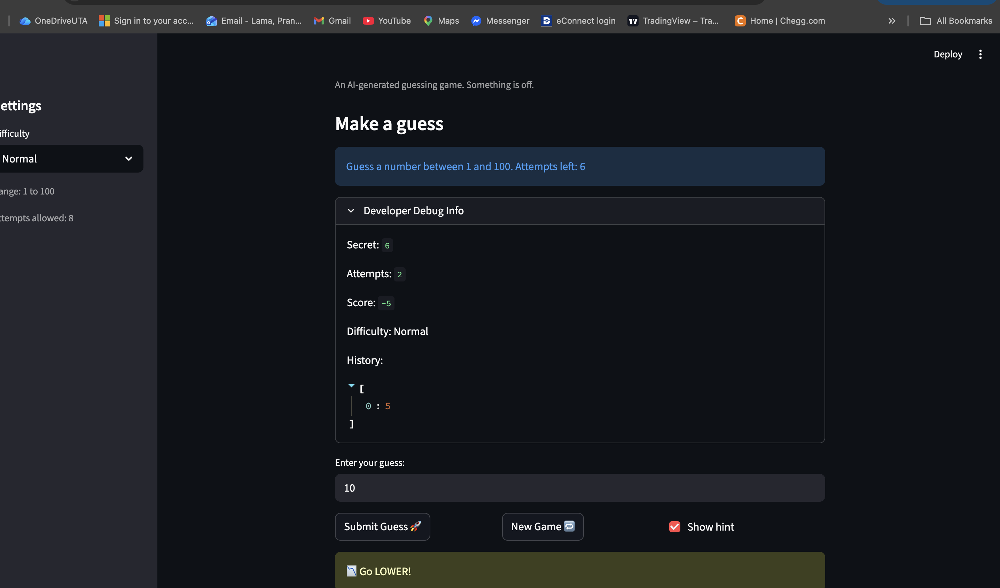
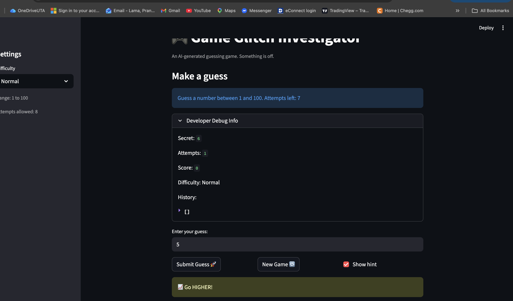
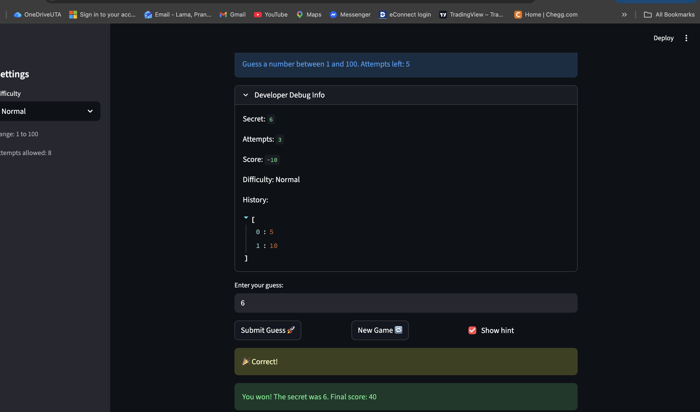

# 🎮 Game Glitch Investigator: The Impossible Guesser

## 🚨 The Situation

You asked an AI to build a simple "Number Guessing Game" using Streamlit.
It wrote the code, ran away, and now the game is unplayable. 

- You can't win.
- The hints lie to you.
- The secret number seems to have commitment issues.

## 🛠️ Setup

1. Install dependencies: `pip install -r requirements.txt`
2. Run the broken app: `python -m streamlit run app.py`

## 🕵️‍♂️ Your Mission

1. **Play the game.** Open the "Developer Debug Info" tab in the app to see the secret number. Try to win.
2. **Find the State Bug.** Why does the secret number change every time you click "Submit"? Ask ChatGPT: *"How do I keep a variable from resetting in Streamlit when I click a button?"*
3. **Fix the Logic.** The hints ("Higher/Lower") are wrong. Fix them.
4. **Refactor & Test.** - Move the logic into `logic_utils.py`.
   - Run `pytest` in your terminal.
   - Keep fixing until all tests pass!

## 📝 Document Your Experience

**Purpose:**
A number guessing game where the player tries to guess a secret number within a limited number of attempts. The difficulty setting changes the number range and attempt limit.

**Bugs Found:**
- Hints were backwards — "Go Higher" showed when the guess was too high, and vice versa.
- On even-numbered attempts, the secret number was silently converted to a string, causing wrong comparisons (e.g. `"9" > "10"` is `True` in Python string comparison).
- `logic_utils.py` had placeholder `NotImplementedError` stubs instead of real implementations.
- Existing tests compared the full return tuple to a plain string, so they always failed.

**Fixes Applied:**
- Swapped the hint messages in `check_guess` so "Go LOWER!" shows when guess is too high and "Go HIGHER!" when too low.
- Removed the even-attempt string conversion so the secret is always compared as an integer.
- Implemented all four functions in `logic_utils.py` by moving the logic from `app.py`.
- Fixed existing tests to unpack the `(outcome, message)` tuple before asserting.
- Added `tests/conftest.py` so pytest can find `logic_utils` when running from any directory.
- Added three new pytest cases that directly target the two bugs fixed above.

## 📸 Demo

## 🚀 Stretch Features

- [ ] [If you choose to complete Challenge 4, insert a screenshot of your Enhanced Game UI here]
